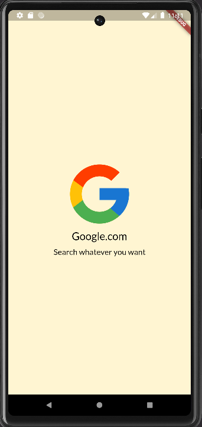

# UI Design - 15+ Screen

## Screens

### 1. Hello Word

### 2. Image

### 3. Circle Avatar

### 4. ElevatedButton

### 5. TextButton

### 6. OutlineButton

### 7. IconButton

### 8. Image and Title

### 9. Background Color

### 10. Login

### 11. Row for like

### 12. Google OutlineButton

### 13. Social Media Card

### 14. Social Media Grid

### 15. Share post

### 16. Post

### 17. Post Preview

### 18. Login Background Image

### 19. Form

### 20. Post Buy or Cart

### 21. Product List

### 22. Post List

### 23. Product Grid
